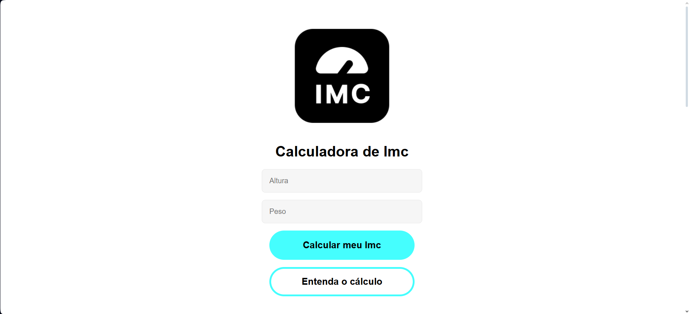

# Calculadora de IMC

calculadora de IMC (Índice de Massa Corporal) simples, desenvolvida com **Blazor WebAssembly (.NET 9.0)** e pronta para execução como **Progressive Web App (PWA)**.



---

## Sobre

Esta aplicação permite calcular o **IMC (Índice de Massa Corporal)** com base no peso e altura informados pelo usuário.  
O resultado indica em qual faixa de peso a pessoa se encontra, de acordo com os padrões mais usados para adultos, como:

- Abaixo do peso
- Peso ideal
- Sobrepeso

O cálculo é feito diretamente no navegador e os resultados ficam salvos no **LocalStorage**.

---

## Cálculo do IMC

A fórmula utilizada para calcular o IMC é a padrão:

```bash
public double Value => (Weight ?? 1) / ((Height ?? 1) * (Height ?? 1));
```


Essa expressão garante que nunca ocorra divisão por zero, usando 1 como fallback para peso ou altura caso não sejam informados.

O resultado é então classificado segundo faixas comuns usadas para avaliação de peso.

---

## Tecnologias

Este projeto utiliza:

- **.NET 9.0**
- **Blazor WebAssembly**
- **HTML**
- **CSS**
- **Javascript**
- **LocalStorage** (persistência local no navegador)
- **PWA (Progressive Web App)**  

---

## Pré-requisito para rodar localmente

Ter o .NET 9.0 instalado em sua máquina. Você pode baixá-lo <a href="https://dotnet.microsoft.com/pt-br/download">aqui</a>.

---

## Como Rodar Localmente

1. Clone este repositório:
   ```bash
   git clone https://github.com/CostaDenis/calculadora-imc.git
   ```

2. Acesse a pasta do projeto:
    ```bash
    cd Imc
    ```

3. Execute a aplicação:
    ```bash
    dotnet watch run
    ```

---
